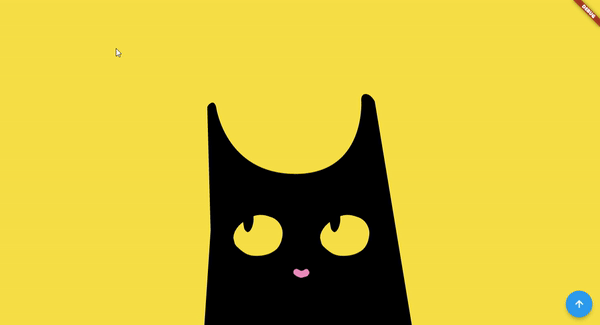
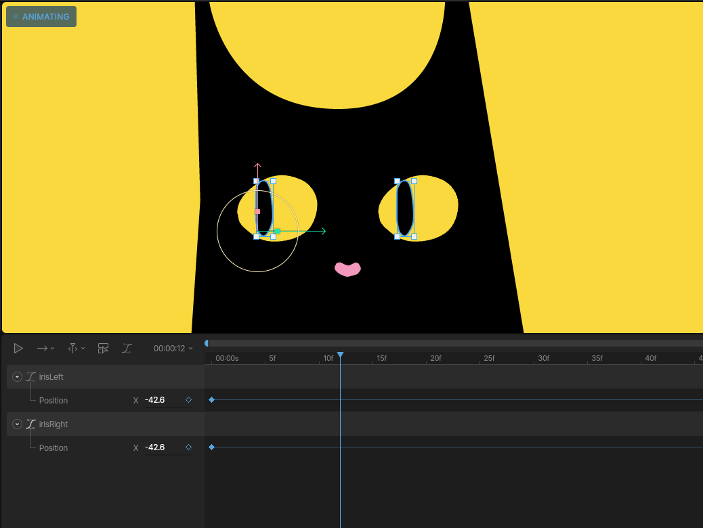

# cat_mouse_tracker
A cat mouse tracker made with flutter for programming and rive for animations.



## GitHub Pages 🖥️
This project is hosted in GitHub Pages. You can check it out [here](https://cabrakill.github.io/cat_mouse_tracker/).

## Github Actions ⏯️
The project is configured to build and deploy the web version in GitHub Pages. The configuration is in the .github/workflows folder.
* [build web workflow](https://github.com/CabraKill/cat_mouse_tracker/actions/workflows/flutter-build-deploy.yml)

## Animation ✏️




The animations were made using Rive. It's a technology that allows us create interactive animations, according to its definition. [*Home page*](https://rive.app/).

* [rive flutter package](https://pub.dev/packages/rive)
* [rive project link](https://rive.app/s/B6SRBjLbS0_OTiay54tpQQ/)

## About the inspiration 🐈‍⬛
The cat was inspired in Espelunca restaurant mascot with lovely faces and form. You can check them out in @vamodeespelunca Instagram.

## Web build 👨‍💻

To host it in GitHub pages, with the current configuration, it's necessary to build the web version with a specific path for href. To do that, run the following command:

```bash
flutter build web --base-href "/cat_mouse_tracker/"
```
